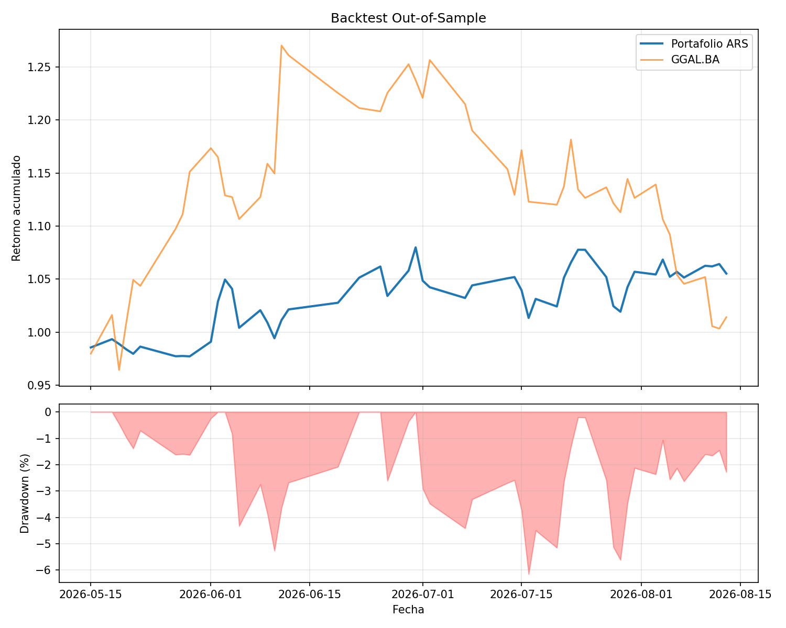
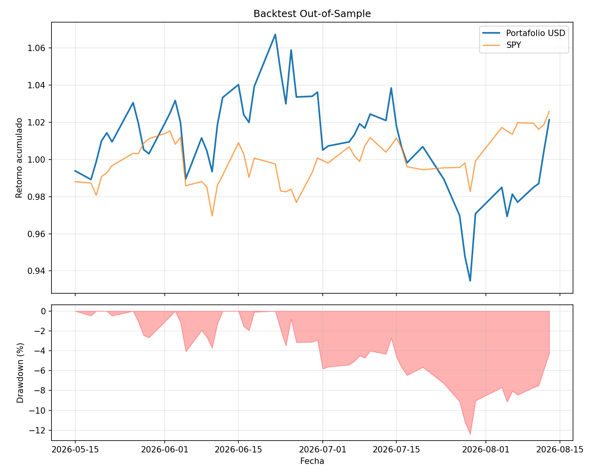
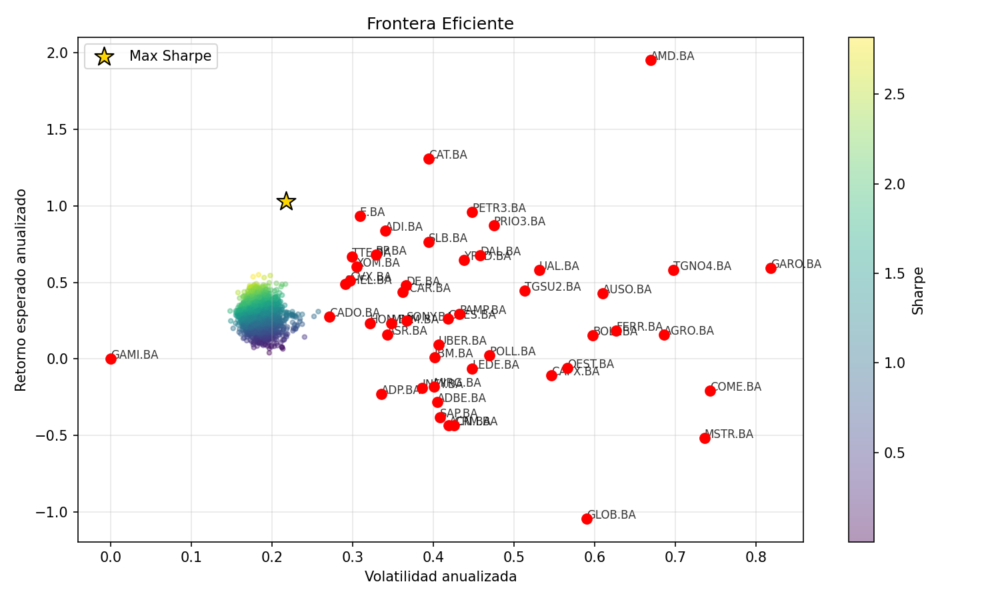
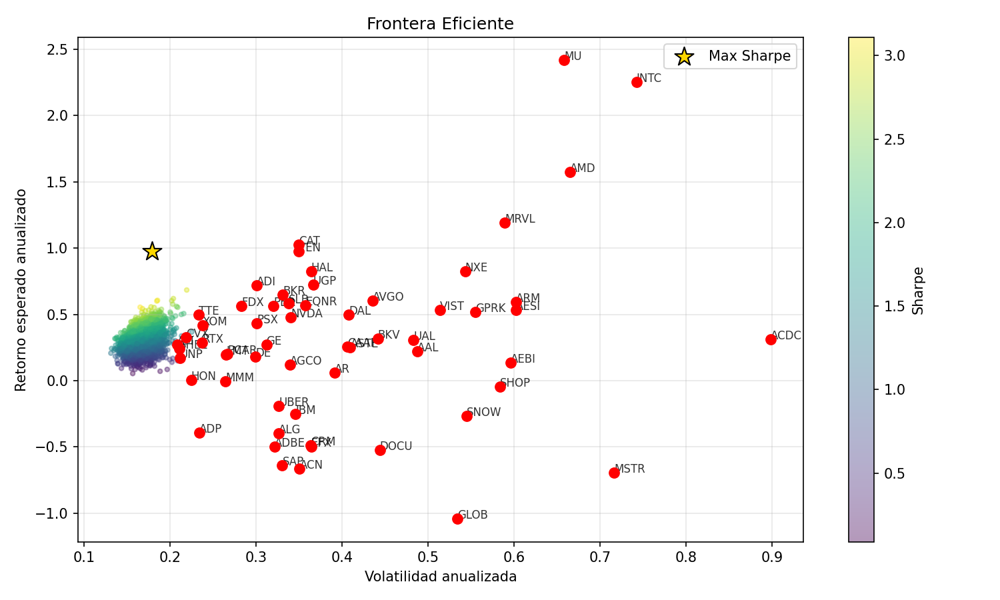
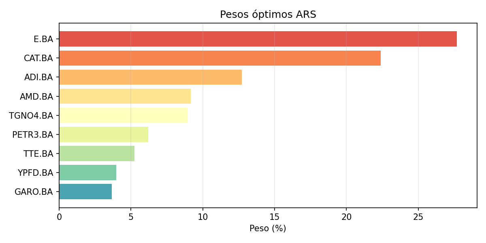
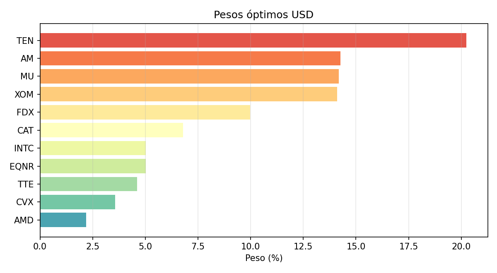

# Backtest Walk-Forward del Constructor
**Fecha:** 2026-08-14

- **Ventana de entrenamiento:** 2025-05-14 a 2026-05-14
- **Ventana de test (forward):** 2026-05-14 a 2026-08-14
- **Sectores beneficiados:** Energía, Tecnología, Acciones Industriales

## Resultados USD (out-of-sample)
| Métrica | Portafolio | SPY |
|---|---|---|
| Retorno total | 2.13% | 2.58% |
| Volatilidad anualizada | 24.60% | — |
| Sharpe | 0.220 | — |
| Max Drawdown | -12.41% | — |
| Diferencia vs benchmark | -0.45% | — |
| Días evaluados | 57 | 57 |

## Pesos óptimos USD
| ticker   |   peso_pct |
|:---------|-----------:|
| TEN      |   20.2424  |
| AM       |   14.2559  |
| MU       |   14.1938  |
| XOM      |   14.1035  |
| FDX      |    9.98425 |
| CAT      |    6.79964 |
| INTC     |    5.03161 |
| EQNR     |    5.02305 |
| TTE      |    4.6081  |
| CVX      |    3.56043 |
| AMD      |    2.19734 |

**Conclusión:** el portafolio optimizado NO superó al benchmark SPY en el periodo forward.

## Resultados ARS (out-of-sample)
| Métrica | Portafolio | GGAL.BA |
|---|---|---|
| Retorno total | 5.53% | 1.41% |
| Volatilidad anualizada | 25.12% | — |
| Sharpe | 0.887 | — |
| Max Drawdown | -6.16% | — |
| Diferencia vs benchmark | 4.12% | — |
| Días evaluados | 53 | 53 |

## Pesos óptimos ARS
| ticker   |   peso_pct |
|:---------|-----------:|
| E.BA     |   27.7015  |
| CAT.BA   |   22.4004  |
| ADI.BA   |   12.7148  |
| AMD.BA   |    9.17129 |
| TGNO4.BA |    8.922   |
| PETR3.BA |    6.21217 |
| TTE.BA   |    5.25311 |
| YPFD.BA  |    3.97109 |
| GARO.BA  |    3.65364 |

**Conclusión:** el portafolio optimizado superó al benchmark GGAL.BA en el periodo forward.

## Visualizaciones
Los gráficos se guardaron en `charts/`
- 
- 
- 
- 
- 
- 

> Nota: este backtest usa los pesos calculados en entrenamiento y los mantiene fijos en test. No incluye rebalanceo, comisiones ni slippage.